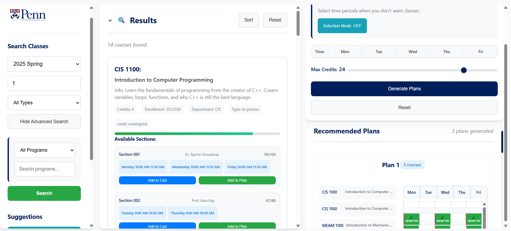

# CIS 5120
## Assignment 1 - Course Planning System

A reworked path@penn web page for course planning and registration. 
PC View of the page as shown below:



## How to Run
Open [`assignment_1/index.html`](assignment_1/index.html) in your web browser. No server setup is required because there is no backend.

## How to Use

1. Select a semester from the dropdown menu.
2. Type a keyword (e.g., "CIS" or "1") into the search bar.
3. Click the "Search" button to find courses matching your criteria.
4. Add desired courses to your plan or cart by clicking the respective buttons.
5. Generate your course plan to finalize your selections.

## File Structure

```
assignment_1/
├── index.html              # Main HTML file
├── styles.css              # All CSS styling
├── assets/
│   └── penn_logo.png       # University logo
└── js/
    ├── main.js             # Main application logic
    ├── courseData.js       # Course data and search functions
    └── programsData.js     # Engineering programs and utilities
```

## Credits


Penn - For using the LOGO and some of the other resources